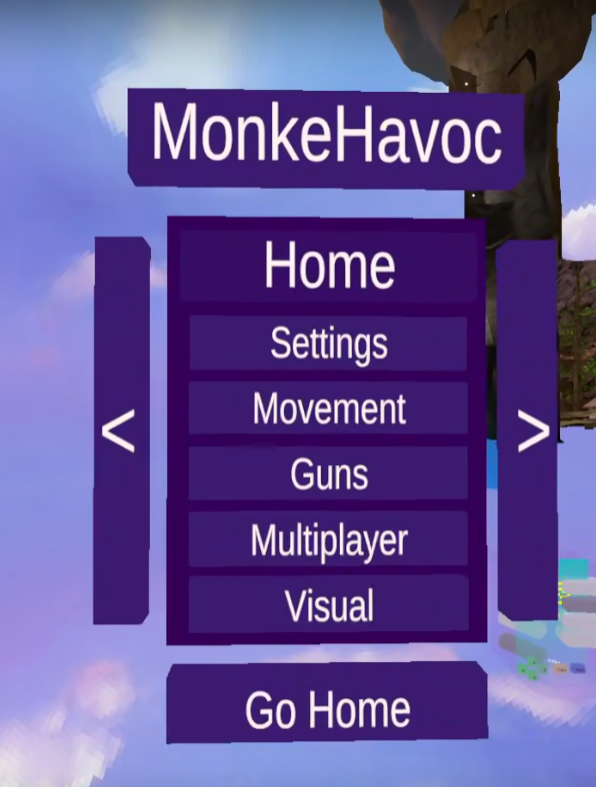


# Monke Havoc Mod Panel
### Monke Havoc is a modular panel for the popular children's VR game "Gorilla Tag"
## Developers/Contributors:
* HanSolo1000Falcon - Head Developer
* ArielTheMonke - Module Developer/Tester
* ToastConcern - Module Developer
* Monky - Module Tester/Teleport Patch Fixer
## Features/Modules:
### `Movement`:
* `Airplane`
* `Checkpoint`
* `Fly`
* `Frozone`
* `Long Arms`
* `No Clip`
* `No Slip`
* `Slippy Hands`
* `Platforms`
* `Speedboost`
### `Guns`:
* `Hoverboard Gun`
* `Teleport Gun`
### `Multiplayer`;
* `Box ESP`
* `Bone ESP`
* `Tracers`
### `Visual`:
* `Day`
* `Evening`
* `Morning`
* `Night`
* `Rain`
* `No Rain`
### `Spawners`:
* `Remove All`
* `Cube Spawner`
* `Cube Spammer`
* `Cylinder Spawner`
* `Cylinder Spammer`
* `Sphere Spawner`
* `Sphere Spammer`
### `Horror`:
* `Scary Back`
* `Real Time Lighting`
* `No Real Time Lighting`

